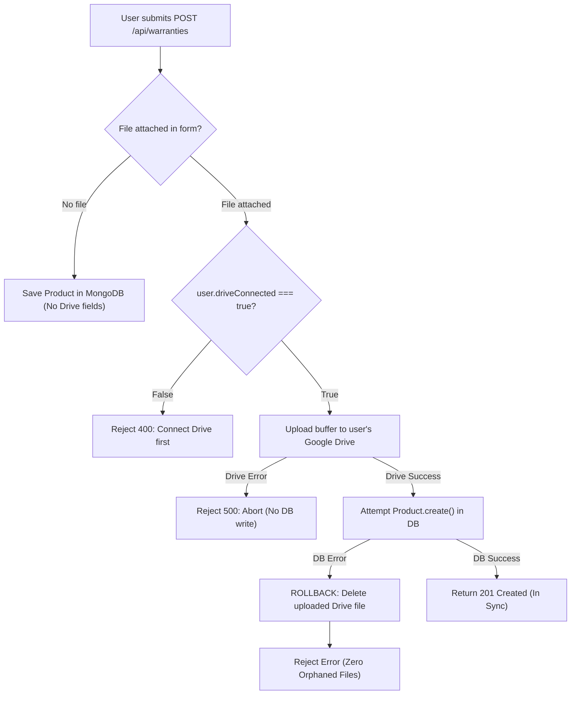

# 0. Product Goals & Problem Statement (`0_goal.md`)

> **Note for Future Self**: This document explains what Receipt Collector is, the real-world problem it solves, and the full rationale behind every feature. Read this first whenever you need to refresh your understanding of the product vision and core priorities.

---

## 1. Executive Summary & The Real-World Problem

### The Everyday Problem
Almost everyone purchases appliances, electronics, gadgets, furniture, and tools that come with manufacturer warranties. However, when an item breaks down or malfunctions:
1. **Lost or Faded Receipts**: Physical paper receipts fade over time or end up buried in shoeboxes and drawers. By the time a device breaks (often 10–11 months into a 1-year warranty), the proof of purchase is gone.
2. **Forgotten Expiry Dates**: Warranties expire silently. Users only realize a warranty expired last week when the product suddenly malfunctions today, costing them hundreds of dollars in out-of-pocket repairs or replacements.
3. **Friction in Claiming**: Even with a receipt, finding manufacturer claim portals, support numbers, serial number requirements, and warranty terms is confusing and stressful.
4. **Cloud Privacy & Storage Costs**: Traditional SaaS apps store user receipts on their own AWS S3 / Cloud buckets. This creates high ongoing hosting costs for the business and privacy hesitations for users who don't want personal purchase documents living on an unknown third-party server.

### The Solution: Receipt Collector
**Receipt Collector** is a consumer-focused SaaS application built to eliminate the hassle of lost invoices and missed warranty claims. It provides a secure **Warranty Vault**, tracks expiration timelines, sends automated multi-channel reminders before coverage ends, and securely archives original purchase documents directly in the user's personal Google Drive.

---

## 2. Core Feature Breakdown (Why Each Feature Exists)

Every feature in Receipt Collector is designed to address a specific user friction point in the warranty lifecycle.

```
Purchase Product ──► Store in Vault & Drive ──► Automated Reminders ──► Guided Claim Checklist
      │                       │                        │                        │
  Manual or OCR         "Bring Your Own"          30 / 7 / 1 Days           Manufacturer Links,
  Data Entry            Google Drive BYOS         Before Expiry             Model/Serial Details
```

---

### Feature 1: The Warranty / Product Vault
- **What It Is**: A centralized digital catalog where users manage all their physical products and associated warranty metadata (Product Name, Brand, Category, Model Number, Serial Number, Purchase Date, Retailer, Price, Warranty Duration in Months, and Auto-Calculated Expiry Date).
- **Why It Exists**: Users need a single source of truth for their high-value possessions. Instead of searching through emails and paper files, all critical warranty parameters are standardized and easily searchable in one dashboard.

---

### Feature 2: Document Storage via Google Drive Integration ("Bring Your Own Storage" / BYOS)
- **What It Is**: When a user uploads a receipt or invoice (PDF or image), the file is transmitted to the backend and stored directly in a dedicated folder inside the **user's own Google Drive account**. The app only stores the Drive `fileId`, web link, and extracted metadata in its database.
- **Why It Exists**:
  1. **Zero Storage Infrastructure Costs**: The platform does not pay ongoing monthly cloud storage fees (S3, Cloudinary, etc.) for gigabytes of high-resolution invoice photos.
  2. **High Trust & Data Ownership**: Users retain complete sovereignty over their documents. If they ever stop using Receipt Collector, their invoices remain safely in their own Google Drive.
  3. **Privacy-Focused Scope (`drive.file`)**: The app requests permission only to view and manage files that the app itself creates. It cannot view, read, or modify any other files in the user's Drive.

#### Atomic Upload & Rollback Flow:


---

### Feature 3: Expiry Tracking & Automated Reminder Engine
- **What It Is**: Automatically calculates the exact expiration date (`purchaseDate + warrantyMonths`) upon creation or editing. A scheduled cron worker evaluates upcoming expirations daily and dispatches automated notifications (Email, Push, WhatsApp) at configurable thresholds (e.g., 30 days, 7 days, and 1 day before expiry).
- **Why It Exists**: **This is the core differentiator of the product.** Storing a receipt is passive; reminding a user *before* their warranty expires turns the app into an active money-saving tool. For example, a 30-day reminder gives users enough time to inspect an aging laptop battery or rattling washing machine and file a claim while still covered.

---

### Feature 4: OCR Auto-Extraction *(Planned — Not Yet Implemented)*
- **What It Is**: An automated document parsing pipeline (using AWS Textract, Google Cloud Vision, or Tesseract) that reads uploaded receipts/invoices and automatically extracts the purchase date, store/retailer name, total price, product title, and warranty period.
- **Why It Exists**: Manual data entry is the #1 drop-off point in consumer apps. Users hate typing out serial numbers, dates, and prices. OCR turns adding a product into a 5-second "snap and save" action. Manual entry remains as a reliable fallback.

---

### Feature 5: Guided Claim Assistance & Checklists *(Planned — Not Yet Implemented)*
- **What It Is**: Category-specific and brand-specific claim guides detailing what documentation is required, manufacturer support hotline numbers, and direct links to warranty submission portals. Includes a claim status tracker (e.g., *Claim Initiated*, *Under Review*, *Repaired/Replaced*).
- **Why It Exists**: When a product breaks, users often panic and don't know the exact steps to initiate an official claim. Giving them a ready-to-use checklist with their receipt, serial number, and direct link makes the claim process seamless.

---

### Feature 6: Authentication & Security
- **What It Is**: Dual authentication system supporting both standard Email/Password (with JWT access and refresh token rotation) and Google OAuth 2.0 (with automatic account linking based on verified email).
- **Why It Exists**: Gives users the convenience of 1-click Google Sign-In while providing standard email authentication for users who prefer credential-based logins.

---

## 3. Future & Deferred Features (V2 Scope)

To ensure the MVP reaches production rapidly and reliably, the following features are intentionally deferred:

| Feature | Description | Reason for Deferring |
| :--- | :--- | :--- |
| **ML-Based Recommendations** | AI suggesting extended warranties, resale value estimates, or repair tips. | Requires a large dataset of historical claims and product reliability data. Core loop must be validated first. |
| **Email Inbox Auto-Parsing** | Connecting to Gmail/Outlook to auto-detect receipts from Amazon, Best Buy, etc. | High security sensitivity and requires complex third-party email permission scopes. |
| **Family / Shared Vaults** | Multi-user shared workspaces for household appliances. | Adds complex RBAC (Role-Based Access Control) and permission logic to database queries. |
| **Marketplace Order History Sync** | 1-click import from Amazon, Walmart, or Flipkart APIs. | High integration complexity and dependent on private partner APIs. |
| **Barcode / Serial Scanner via Camera** | Live camera barcode scanning to auto-lookup model numbers. | Polish feature; manual text input is sufficient for the MVP. |

---

## 4. Key Architectural & Strategic Principles

1. **Keep the Core Loop Tight**: The entire value proposition rests on: **Upload Receipt $\rightarrow$ Track Expiry $\rightarrow$ Receive Notification $\rightarrow$ File Claim Successfully**. Everything else is secondary.
2. **Decouple Heavy Workloads**: Heavy tasks like OCR processing and email batch sending must never block the main Express HTTP request-response cycle.
3. **Stateless Backend with Secure Token Storage**: APIs remain stateless for horizontal scalability, using cryptographically signed JWTs and HTTP-only cookies to eliminate token theft vulnerabilities.
