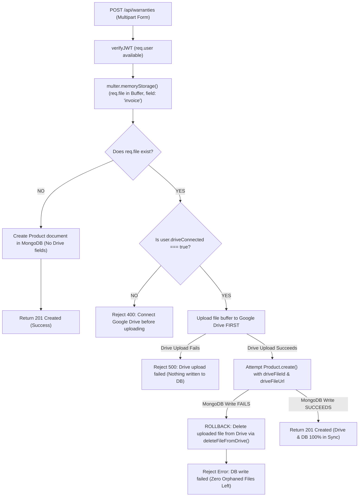

# 2. Technology Stack & Architectural Decision Records (`2_tech_stack.md`)

> **Note for Future Self**: This document records every technology chosen in the project, the alternatives that were considered, the reasoning behind each choice, and the conscious trade-offs accepted. Read this to understand why the system is built the way it is.

---

## 1. Tech Stack Matrix

| Layer | Technology | Primary Alternative Considered | Why Chosen |
| :--- | :--- | :--- | :--- |
| **Frontend Framework** | **Next.js 14+ (React)** | Vite + React SPA | Server-side rendering, App Router, built-in routing, and rapid UI development. |
| **Backend Framework** | **Express.js (Node.js ESM)** | FastAPI (Python) | High ecosystem maturity, full JavaScript stack consistency, and active learning fluency. |
| **Database** | **MongoDB Atlas (Mongoose)** | PostgreSQL (SQL) | Schema flexibility across diverse consumer product categories; JSON-native document model. |
| **Document Storage** | **Google Drive (BYOS)** | AWS S3 / Cloudinary | Zero platform storage fees, maximum user trust, and simplified document sovereignty. |
| **Authentication** | **JWT + Google OAuth 2.0** | Server-Side Sessions (Redis) | Stateless API scaling, secure token rotation, and 1-click Google sign-in. |
| **Google SDK** | **`googleapis`** | Passport.js (`passport-google-oauth20`) | Single unified SDK for both OAuth authentication and future Google Drive file API operations. |
| **OCR Pipeline** *(Planned)* | **AWS Textract / Google Vision** | Tesseract.js (Client-side) | Higher accuracy on distorted receipts, structured key-value extraction, and server reliability. |
| **Notification Engine** *(Planned)* | **Node-Cron + SES / SendGrid** | Redis BullMQ / Celery | Lightweight scheduling without requiring dedicated Redis infrastructure in MVP. |

---

## 2. Key Architectural Decisions (Deep-Dive)

---

### Decision 1: Google Drive "Bring Your Own Storage" (BYOS) vs. Dedicated S3 Bucket

#### The Decision
Receipt Collector does **not** store receipt images/PDFs on a centralized company S3 bucket. Instead, documents are uploaded directly into the **user's own Google Drive** using the Google Drive REST API.

#### Why We Made This Decision
1. **Zero Storage Cost Overhead**: High-resolution receipts and multi-page PDFs consume substantial storage and bandwidth. By having files saved in the user's Drive, storage costs are zero for the platform.
2. **The Trust Factor**: Users are hesitant to upload personal financial receipts, credit card slips, and invoices to an unknown third-party server. Saving files in their personal Google Drive gives them 100% data ownership.
3. **No Lock-In**: If a user stops using Receipt Collector, all their organized receipts remain in their Google Drive folder.

#### Scope Choice: Why `drive.file` instead of full `drive` scope
- **`https://www.googleapis.com/auth/drive.file`**: Grants access **only** to files and folders created or opened by Receipt Collector. It **cannot** read, list, or modify any existing private documents in the user's Drive.
- **Why This Matters**:
  - The Google consent screen displays a clear, non-intimidating prompt ("Create and edit files that this app creates").
  - It completely avoids Google's costly and lengthy **CASA (Cloud Application Security Assessment)** manual security audit required for broader restricted Drive scopes.

#### Token Security: AES-256-GCM Encryption in DB (`utils/crypto.js`)
Google Drive refresh tokens grant persistent authorization to upload and manage documents inside the user's Google Drive. Storing these tokens in plaintext in MongoDB is an unacceptable vulnerability in case of database leaks or backups being intercepted.

##### Why Two-Way Encryption (AES-256-GCM) instead of One-Way Hashing (`bcrypt`)?
- **Passwords use one-way hashing (`bcrypt`)**: The server only needs to verify if an incoming password matches the stored hash (`bcrypt.compare`). The server **never** needs to recover the original plaintext password.
- **Google Drive tokens require two-way encryption (`crypto.js`)**: To upload receipts to Google Drive on the user's behalf, the backend **must be able to decrypt the token back to its original plain text** so it can pass it to Google's OAuth API.

```
       Plain Text Token ──► [ encrypt() ] ──► Encrypted String (Saved in MongoDB)
                                                    │
                                                    ▼
(When uploading file) ──► [ decrypt() ] ◄── Read from MongoDB
                               │
                               ▼
                        Plain Text Token ──► Sent to Google Drive API
```

##### Why AES-256-GCM Specifically?
1. **AES-256 (256-bit Key)**: Military-grade symmetric encryption using a 32-byte hexadecimal secret key (`ENCRYPTION_KEY` in `.env`).
2. **GCM Mode (Authenticated Encryption / AEAD)**: Unlike legacy modes like CBC or ECB, GCM provides **both confidentiality (secrecy) and integrity (tamper detection)**.
3. **Authentication Tag (`authTag`)**: GCM produces a 16-byte cryptographic signature. If an attacker or malicious script tampers with even a single bit of the ciphertext in MongoDB, `decipher.setAuthTag()` detects the discrepancy and throws an error immediately, preventing padding oracle attacks and bit-flipping manipulation.
4. **Unique Random IV per Encryption**: Every call to `encrypt()` generates a fresh 12-byte random **Initialization Vector (IV)** (`crypto.randomBytes(12)`). Encrypting the same token twice produces completely different ciphertexts, preventing pattern recognition.

##### Serialized Format & Step-by-Step Mechanics
The encrypted token is serialized as a colon-separated string:
$$\text{iv} : \text{authTag} : \text{encryptedData}$$
*(Example: `23f2ca... : 62a196... : 1b270d...`)*

- **`encrypt(text)`**: Generates 12-byte IV $\rightarrow$ Encrypts payload with `aes-256-gcm` $\rightarrow$ Extracts 16-byte Auth Tag $\rightarrow$ Returns `iv:authTag:encryptedData`.
- **`decrypt(encryptedText)`**: Splits `encryptedText` by `:` $\rightarrow$ Attaches Auth Tag to decipher $\rightarrow$ Reconstructs plaintext. If the key or ciphertext was modified, decryption fails securely.

#### Offline Access & Google Cloud Status Gotcha
- While an app is in **"Testing"** status in the Google Cloud Console, OAuth refresh tokens expire after **7 days**, regardless of activity.
- Before public release, the OAuth consent screen must be published to **"In Production"** so refresh tokens remain valid indefinitely until revoked.

---

### Decision 2: Two Separate Google OAuth Flows (Login vs. Drive Connect)

#### The Decision
Google OAuth is strictly split into **two distinct flows**:
1. **Login Flow (`/api/auth/google`)**:
   - Scope: `['openid', 'email', 'profile']`
   - Access Type: `'online'` (no refresh token required; used purely for authentication and profile data).
2. **Drive-Connect Flow (`/api/auth/google/drive/connect`)** *(Step 2)*:
   - Scope: `['https://www.googleapis.com/auth/drive.file']`
   - Access Type: `'offline'`, `prompt: 'consent'` (forces Google to issue a long-lived refresh token).
   - Triggered **only** when the user attempts their first receipt upload or manually connects Drive in Settings.

#### Why Split Instead of One Combined Flow?
- **Reduces Signup Friction**: Asking for Google Drive permissions during initial account registration scares away new users who just want to try the app.
- **Separation of Concerns**: Authentication identity should never be tightly coupled to storage permissions. If a user only wants to use manual warranty entry without Drive storage, they can do so freely.

---

### Decision 2B: Atomic Google Drive Upload & Database Rollback (Zero Orphaned Files Guarantee)

#### The Problem
When integrating third-party cloud storage (Google Drive) with a database (MongoDB), two distinct failure modes can corrupt data integrity:
1. **Dangling DB Record**: If MongoDB writes first and Drive upload fails, the database has a record pointing to a non-existent file.
2. **Orphaned Cloud File**: If Drive uploads first and MongoDB validation/write fails, a useless file remains in the user's Google Drive taking up space with no matching database record.

#### Architectural Choice: "Option A" (Single Multipart Form) vs "Option B" (Two-Step Upload)
We explicitly chose **Option A** — handling file upload directly within `POST /api/warranties` as a `multipart/form-data` payload, rather than creating a warranty first and attaching the file in a secondary endpoint.
- **Why Option A**:
  - **Simpler Frontend UX**: The user fills in the warranty details, selects an invoice file, and clicks "Save" once.
  - **No Half-Created States**: Prevents lingering incomplete states where a user creates a warranty record but the secondary file upload fails or is abandoned before completion.

#### The Architectural Solution & Flowchart
To solve this, we implemented an **atomic upload-first pipeline with automatic rollback**:



#### Key Rules Enforced:
1. **Drive Connection Required ONLY for File Upload**: Users who only want manual warranty tracking without linking Google Drive can create warranties freely. Drive connection (`user.driveConnected === true`) is only enforced when `req.file` is present.
2. **Multer Memory Storage (`multer.memoryStorage()`)**: In-memory buffering eliminates temporary disk files on the server. Files stream directly from memory buffer to Google Drive API.
3. **Dedicated Vault Folder with Fallback**: Files are saved into an auto-managed `"Receipt Collector Vault"` folder in the user's Drive. If the saved `driveFolderId` was deleted manually by the user in Google Drive, the service detects the missing folder and automatically recreates it.
4. **Per-Request Fresh `OAuth2Client` (Concurrency Protection)**:
   - Instead of sharing a global singleton OAuth client for Drive API calls, `getDriveClient(user)` instantiates a fresh `new google.auth.OAuth2()` instance per request.
   - *Why*: A shared singleton client with `setCredentials()` creates a critical race condition where concurrent requests from User A and User B could overwrite each other's credentials in flight.

---

### Decision 3: Express.js (Node.js ESM) vs. FastAPI (Python)

#### The Decision
We chose Express.js with ES Modules (`"type": "module"`) over Python FastAPI.

#### Why We Made This Decision
- **Developer Velocity & Fluency**: Focuses on mastery of Node.js / Express backend patterns without switching languages between frontend (JavaScript) and backend.
- **How Machine Learning Fits Later**: If ML-based recommendations or warranty analysis are introduced in V2, ML does **not** need to run inside the Express monolith. It will be built as an independent Python microservice that Express communicates with over private HTTP endpoints.

---

### Decision 4: MongoDB (Mongoose) vs. Relational SQL (PostgreSQL)

#### The Decision
We chose MongoDB Atlas with Mongoose ODM.

#### Why We Made This Decision
- **Varying Schema Shapes**: Product warranty data varies greatly across categories:
  - *Electronics*: Model number, IMEI, serial number, battery warranty vs. device warranty.
  - *Appliances*: Installation date, compressor warranty, service contact.
  - *Furniture / Tools*: Lifetime frame warranty, proof of purchase receipt.
- A flexible document model accommodates category-specific JSON fields naturally without requiring dozens of sparse SQL columns or complex polymorphic join tables.

#### Accepted Trade-offs
- MongoDB transactions and joins (`$lookup`) are more complex than native SQL relational joins.
- **Mitigation**: Data models are carefully structured with embedded metadata where appropriate (e.g., `preferences`, `ocrData`) and clean references for relations (`user` $\rightarrow$ `products` $\rightarrow$ `reminders`).

---

### Decision 5: JWT Access + Refresh Token Rotation & HTTP-Only Cookies vs. Sessions

#### The Decision
We implemented a dual-token JWT architecture stored strictly in **HTTP-Only, SameSite cookies**.

#### How It Works
```
Client Request ──► [AccessToken (15m)] valid? ──► Execute Controller
                         │ (Expired)
                         ▼
                   POST /api/auth/refresh-token
                         │
        [RefreshToken (7d)] matches DB? ──► Rotate Tokens in DB & Cookies
```

#### Why We Made This Decision
1. **Short-Lived Access Token (~15 mins)**: Cannot be revoked individually, so keeping its lifespan short limits the window of exposure if intercepted.
2. **Long-Lived Refresh Token (7 days) with DB Rotation**: Stored in the database (`user.refreshToken`). Every time a new access token is requested, the refresh token is rotated (old one invalidated). If a leaked refresh token is reused, the mismatch alerts the system.
3. **HTTP-Only Cookies (No Tokens in JSON Body)**: Storing tokens in `localStorage` or returning them in API JSON bodies exposes them to **XSS (Cross-Site Scripting)** attacks. HTTP-Only cookies are inaccessible to browser JavaScript.

---

### Decision 6: Decoupling Reminders & ML from Google Drive Tokens

1. **Reminders Are Independent of OAuth**:
   - Scheduled expiration reminder emails do **not** touch Google Drive. They read `warrantyExpiryDate` and `user.email` from MongoDB and dispatch via an independent transactional email service (Nodemailer / Gmail SMTP). A revoked Google Drive token will never prevent a user from receiving their expiry reminder.
2. **ML & OCR Do Not Re-Fetch From Drive**:
   - When a receipt is uploaded, OCR extraction runs **immediately** in memory. The structured result is saved directly into `product.ocrData` in MongoDB.
   - Future ML features read from the local `ocrData` field, avoiding slow Google Drive API network calls.

---

### Decision 7: Notification Channels Architecture & Deferral Rationale


#### The Multi-Channel Model
The User schema supports three independent notification channels under `preferences.notificationChannels`:
- `email`: Transactional email notifications (Default: `true`).
- `webPush`: Browser push notifications via Service Worker and Web Push API (Default: `false`).
- `whatsApp`: Instant messaging notifications (Default: `false`).

#### Deferral Rationale (Why Only Email in MVP):
1. **Email Is Universally Available & Free**: Every user has an email address from account registration. Using Gmail SMTP via Nodemailer with an App Password incurs zero infrastructure cost.
2. **Web Push Complexity**: Requires client-side Service Worker registration, VAPID key generation, handling browser permission prompts, and storing per-device subscription endpoints in MongoDB.
3. **WhatsApp Cost & Verification Overhead**: Requires Meta Business Account verification, pre-approved message templates, or paid API providers (e.g., Twilio / MessageBird) which are not suitable for an early-stage MVP.
4. **Forward Compatibility**: The schema, data structures, and reminder generation loops are pre-built to support `webPush` and `whatsApp` later without needing database migrations.

*(Note for future refactoring: User schema uses camelCase `webPush`/`whatsApp` while Reminder model's `channel` enum uses `'push'`/`'whatsapp'`. These should be normalized when implementing the other channels).*

---

### Decision 8: Pre-Computed Reminder Documents vs. On-The-Fly Cron Calculations

#### The Decision
When a warranty is created, individual `Reminder` documents are **pre-calculated and persisted** in MongoDB (one document per reminder interval $\times$ enabled channel), rather than dynamically calculating "who needs a reminder today" inside the cron job.

#### Why Pre-Compute in Advance?
1. **Granular State Tracking**: Each notification has its own lifecycle status (`pending` $\rightarrow$ `sent` / `failed`) and audit timestamp (`sentAt`).
2. **Immunity to Preference Shifts**: If a user later modifies their default interval settings, existing scheduled reminders for registered items remain deterministic.
3. **Non-Blocking Execution**: Reminder generation in `createWarranty` is wrapped in a dedicated `try/catch`. If reminder calculation fails, the core warranty response still succeeds — a missing scheduled reminder is a recoverable minor issue, whereas failing the user's warranty creation would be unacceptable.
4. **Interval Filtering**: Automatically skips reminder dates that have already passed (e.g. adding a product with only 10 days of warranty left will skip the 30-day reminder).

---

### Decision 9: Next Milestone Strategy (Move to Frontend)

#### The Decision
The backend core value loop is now 100% complete and verified:
- **Authentication**: Email/Password + 1-click Google OAuth 2.0 with JWT cookies.
- **Warranty Vault**: Full CRUD scoped to logged-in user.
- **BYOS Storage**: Google Drive OAuth connection and atomic receipt uploads with rollback.
- **Reminder Engine**: Automated expiry calculation, batch reminder scheduling, and hourly cron email dispatcher.

#### Why Move to Frontend Before OCR / Claim Checklists?
- **Working End-to-End User Value Loop**: The application already delivers its primary promise: *Store receipts securely in Google Drive and get notified before warranties expire*.
- OCR auto-extraction and claim checklists are enhancements to an existing workflow, not architectural blockers. Building the Next.js frontend now allows full end-to-end user testing of the core product.

